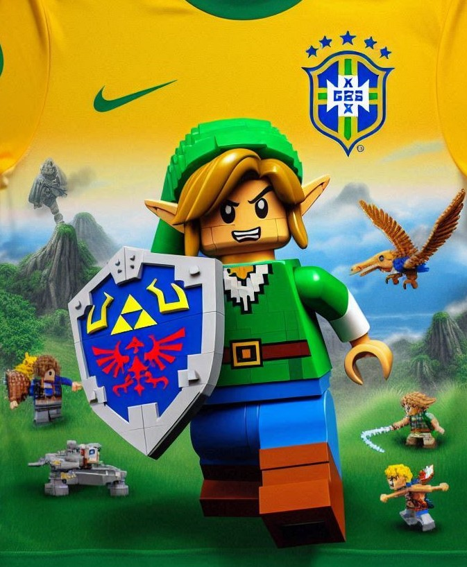

    

# Projeto EBOOK Gerado por I.A.s

 > ℹ️ **NOTE:** Este é o repositório desenvolvido durante o curso Santander 2024 - Fundamentos de IA para Devs na plataforma da [DIO](https://dio.me)

Projeto com o objetivo de gerar um ebook digital com as facilidades das ferramentas de IA. todos os prompts
seguem abaixo.

<a href="https://github.com/VictorSamuraiWol/Project-ebook-aventura-link/blob/main/output/As%20Aventuras%20de%20Link%20na%20Copa%20do%20Mundo%20de%202026%20-%20Victor%20Cardoso.pdf" title="View PDF now"> 📕Clique aqui para ler</a>

## 💻 Tecnologias utilizadas no projeto

- [ChatGPT](https://chat.openai.com/) 
- [Designer do Copilot](https://copilot.microsoft.com/images/create)
- [PowerPoint](https://www.microsoft.com/en/microsoft-365/powerpoint)

### ChatGPT：

|   Ação   | prompt 
| :------: | ------------------------------------------------------------------------------------------------------------------------------------------------------------------------------------------------------------------------------------------------------------------------------ |
| conteúdo | Crie um ebook estilo narração de história de video game sobre uma história de aventura do personagem link do jogo ocarina of time que se transforma em lego, e é convocado para a seleção Zeldaland e ganha a copa do mundo de 2026 {REGRAS} > Explique sempre de maneira simples > Tenha 7 capítulos > Sempre deixe um título sugestivo em cada capítulo > Interligar a história da aventura do jogo zelda ocarina of time com a história da copa do mundo de 2026 |

### Designer do Copilot

|  Ação  | prompt                                                                                |
| :----: | -------------------------------------------------------------------------------------- |
| imagens | Crie imagens do link em formato lego na copa do mundo de 2026 | 
| imagens | Crie imagens do link levantando a taça da copa do mundo de 2026 |
| imagens | Crie imagens de campo de futebol nas aventuras de zelda ocarina of time |

## ✨ Features

- Conteúdo gerado via ChatGPT
- Imagens geradas via Designer do Copilot

## 📚 Materiais

- Imagens utilizadas em `assets`
- ebook gerado durante as aulas em `output`

## 👨‍💻 Estudante Frontend e Aws Cloud

    
    
&nbsp&nbsp&nbspVictor Cardoso 
    &nbsp&nbsp<a href="https://github.com/VictorSamuraiWol">
    GitHub</a>&nbsp;|&nbsp;
    <a href="https://www.linkedin.com/in/victor-cardoso-cloud-front/">LinkedIn</a>

  

---

⌨️ com 💚 por [Victor Cardoso](https://github.com/VictorSamuraiWol)
